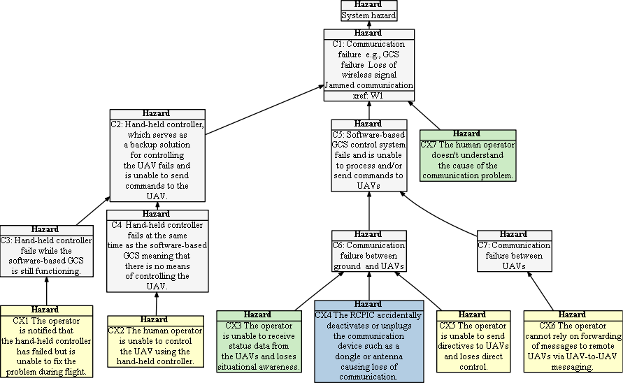

# How to provide feedback

We are working on a project that explores safety-critical hazards associated with the use of small unmanned aerial systems (sUAS) / unmanned aerial vehicles (UAVs) - especially hazards connected with human-drone interactions.  We have developed a set of hazard trees that explore specific human-interaction hazards and their possible mitigations.  
Given your expertise with UAVs we would like to ask you to contribute to this open source resource which is available [here](README.md).  
We plan to create a knowledge base that will be useful to UAV system developers in the future.  All contributors will be fully acknowledged.

 For example, the following hazard tree examines the impact of communication failures upon the operator.  

- System level hazards are shown in gray while human-related hazards are shown in yellow, green, and blue.
-   Green hazards depict loss of situational awareness, and represent hazards in which the operator doesn’t fully understand what the UAVs are doing or their current health etc.  

-   Yellow hazards represent loss of empowerment, in which the operator isn’t able to perform an action that they might like/need to do. 

-   Finally, blue hazards represent mistakes (deliberate or accidental) that the operators might make.

For each of these human-related hazards we have provided a preliminary list of potential mitigations.  
For example the hazard CX2: _“The operator is unable to receive status data from the UAVs and loses situational awareness”_ includes the mitigation that 
_“The The approximate position and the uncertainty of the UAV's current position on the map must be visually depicted
(e.g., by creating an increasingly large 'circle' around the last known, or projected position of the UAV.”_

Please feel free to browse through the hazard trees and to provide feedback.
If you do provide feedback please could you fill in this form so we know a little about your experience with UAVs.
We would invite you to provide feedback in two different ways.  

### 1) Comments and Feedback:
Please take a look at the hazard trees [here](README.md) and then use a github [issue](https://github.com/SAREC-Lab/sUAS-UseCases/issues) or [this form](https://tinyurl.com/HumanDroneHazards) to offer comments and suggestions. 

### 2) Share your stories: 
We are eliciting human-drone interaction stories that include accounts of when “things went wrong”.  

For example in one of our stories, we were running maintenance in the lab and wanted the motors to spin.  
So we disabled GPS related arming checks, but forgot about this and later when flying outside the UAV took off without GPS arming checks. 
In this case we realized something was wrong and immediately landed the UAV -- unfortunately in a very hard landing.  
This was an example of human error which could have been addressed by following the mitigations prescribed in the preflight checks. 
If you have these kinds of ‘human-error’ stories, please share them through this [link](https://tinyurl.com/HumanDroneStories). 

We plan to publish them to the Github repository as a shared resource - and you will have the choice for your name to appear or for them to be posted anonymously.

If you have any furhter questions please email Jane Cleland-Huang (JaneHuang@nd.edu) or Michael Vierhauser (michael.vierhauser@jku.at) 
