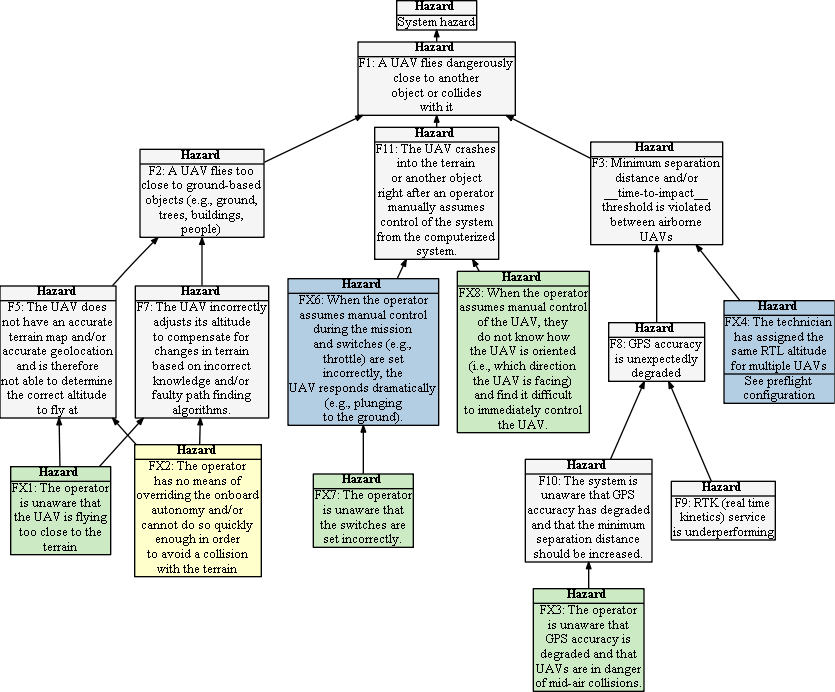

## Hazard Tree: Flight Collisions

Collisions must be avoided between multiple UAVs, UAVs and other objects, and UAVs and the terrain.

Return to [hazard list](../README.md) 

 = Human Initiated Error,  =Loss of Situational Awareness,  = Lack of Empowerment to Intervene

## Human-Drone Interaction hazards 

###   FX1: The operator is unaware that the UAV is flying too close to the terrain

|  | Context | Solution |
|:--|:--|:--|
|FX1-S1| In-Air, BVLOS | When a UAV is flying below a minimum threshold altitude, the system shall automatically display a warning message, notifying the RPIC. |
|FX1-S2| In-Air, BVLOS, Autonomy | When a UAV is flying below a critical threshold altitude and the system autonomously adjusts the flying altitude, the system shall notify the RPIC that it will automatically increase its altitude to maintain a minimum distance from the terrain. |

  

###   FX2: The operator has no means of overriding the onboard autonomy and/or cannot do so quickly enough in order to avoid a collision with the terrain

|  | Context | Solution |
|:--|:--|:--|
|FX2-S1|In-Air, Potentially BVLOS| All of the UAV's autonomous decisions associated with collision avoidance are reported to the operator|
|FX2-S2|In-Air, Potentially BVLOS| The operator has the ability to override autonomous decisions to the fullest extent possible (e.g., return to the pre-decision altitude)|
|FX2-S3|In-Air, Potentially BVLOS| When requested by the user, the UAV must provide a comprehensible explanation of its autonomous decisions|

  

###   FX3: When the operator assumes manual control during the mission and switches (e.g., throttle) are set incorrectly, the UAV responds dramatically (e.g., plunging to the ground). 

|  | Context | Solution |
|:--|:--|:--|
|FX3-S1|Inflight, Control is being passed to manual flight controller| Handover must be iniated by the human who will manually fly the drone (e.g., through the pilot flipping a switch).  The system should not allow the software operator to automatically hand control to the operator as the operator might be unprepared to take control.  Coordination must occur between the two roles.|
|FX3-S2|Inflight, Control is being passed to manual flight controller| The system must have an inbuilt failsafe to prevent the sUAS from flying directly into the ground. In the instance that the throttle is set downwards during a hand-over event, the UAV may descend rapidly but will stop and hover before reaching the ground.|

  

###   FX4: The operator is unaware that the switches are set incorrectly.

|  | Context | Solution |
|:--|:--|:--|
|FX4-S1|Preflight| Training and respective preflight checks shall be introduced that check switch positions before the UAV can arm and take-off. |

  

###   FX5: When the operator assumes manual control of the UAV, they do not know how the UAV is oriented (i.e., which direction the UAV is facing) and find it difficult to immediately control the UAV.

|  | Context | Solution |
|:--|:--|:--|
|FX5-S1|In-Air| Whenever manual control is assumed by the RPIC, all remaining waypoints shall be cancelled by the system immediately and the UAV should switch to hover in place. The RPIC shall receive training on how to identify the heading of a UAV by rotating the UAV clockwise and accelering periodically.|

  

###   FX6: The operator is unaware that GPS accuracy is degraded and that UAVs are in danger of mid-air collisions.

|  | Context | Solution |
|:--|:--|:--|
|FX6-S1| In-Air | If the number of locked sattelites falls below a threshold, the system shall automatically display a warning message, notifying the RPIC. The position inaccuracy shall be displayed in the user interface, e.g. by displaying a circle around the UAV, showing its approx. estimated position.  |

  

###   FX7: The technician has assigned the same RTL altitude for multiple UAVs (See preflight configuration)

|  | Context | Solution |
|:--|:--|:--|
|FX7-S1|Preflight| See [preflight configuration checks](https://github.com/SAREC-Lab/sUAS-UseCases/blob/human-interactions/human-interaction-hazards/preflightchecks.md)|
|FX7-S2|In-Air, RTL | When a UAV switches to RTL, its RTL altitude is displayed in the status bar and a warning is issued if RTL altitudes conflict (i.e., lack minimum altitude separation) for multiple UAVs in RTL mode.|

