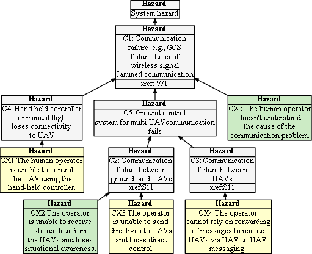

## Hazard Tree: Communication (not completed)

One of the most common causes of accidents with sUAS is caused by loss-of-signal preventing the RPIC from sending commands to the sUAS or receiving status updates. RPICs communicate with their sUAS by sending commands through a hand-held controller (i.e., throttle, forward, backward, sideways, turn) or through use of a computer system (e.g., MissionPlanner, QGroundControl, or custom built software) operating over an alternate communication technique or frequency.  Hazard mitigations are dependent upon the operating context -- specifically whether redundant communication paths exist, and whether the loss of signal is caused by a fault on the UAV or a communication failure. 

Quick Links: [CX1](#CX1) [CX2](#CX2) [CX3](#CX3) [CX4](#CX4) [CX5](#CX5) [(All hazards)](../README.md)

## <a name="CX1">CX1: The human operator is unable to send directives to the UAV using the software-based system.</a>

| Hazard addressed | Context | Solution |
|:--|:--|:--|
|CX1-1|Computer Software controller is the only remote control mechanism.|The RPIC is unable to send commands to the sUAV. They need to be aware of onboard mitigations (geofence, failsafe), consider the operating environment (urban vs. rural area, controlled airspace etc), so that they can make an informed decision about whether to immediately report the fly-away event. 
|CX1-2|A hand-held redundant controller is available |The system reports loss of signal and the human operator attempts to take over manual control using the hand-held controller|

## <a name="CX2">CX2: The human operator is unable to receive status data from the UAVs using the software-based system.</a>

Due to loss of signal no data is transmitted from the UAV.
| Hazard addressed | Context| Solution |
|:--|:--|:--|
|CX2-1|UAV status is normally depicted in a UI | The uncertainty of the UAV's current position on the map must be visually depicted (e.g., by creating an increasingly large 'circle' around the last known, or projected position of the UAV|
|CX2-2|Same as CX2-1|An indicator (e.g., an icon or flashing text) must communicate that communication is lost|

## <a name="CX3">CX3: The human operator is unable to communicate with the UAV via the hand-held controller</a>

One way RPICs communicate with their sUAS by sending commands through a hand-held controller (i.e., throttle, forward, backward, sideways, turn). In environments where the sUAS is controlled by a computer software system, the hand-held controller provides a backup system for taking manual control when problems occur.

| Hazard addressed | Context | Solution |
|:--|:--|:--|
|CX3-1|Hand-held controller is the only remote control mechanism.|The RPIC is unable to send commands to the sUAV. They need to be aware of onboard mitigations (geofence, failsafe), consider the operating environment (urban vs. rural area, controlled airspace etc), so that they can make an informed decision about whether to immediately report the fly-away event. 
|CX3-2|Redundant controllers exist (i.e., hand-held + computer system) and the operator is using the hand-held device because communication from the computer has also failed | As in the previous example, the RPICs needs situational awareness of onboard mitigations (e.g., geofence location and configurations, failsafe mechanisms). This information should be cached in the ground-based computer immediately following initial configuration so that it can be retrieved upon request|
|CX3-3|Same context as UX1-2|The UI must provide the capability to display the cached geofence, failsafe mechanisms, and their configurations upon demand|

## <a name="CX4">CX4: The human operator lacks understanding of the nature of the communication problem</a>

The operator may observe that communication has failed, or perceive it to have failed, without understanding the nature of the problem (e.g., malicious jamming attack, interference, loss of LTE connection). Inorder for the RPIC to respond correctly to the situation, they need to be able to quickly diagnose the problem.

| Hazard addressed | Context | Solution |
|:--|:--|:--|
|CX4-1|Coming soon||

## <a name="CX5">CX5: Doesn't seem like a good one!!!!</a>

Needs clarification.

