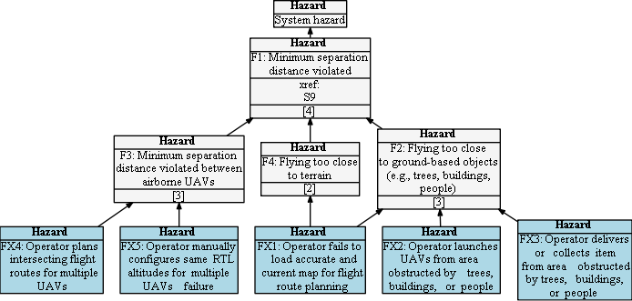

## Hazard Tree: Flight Routes and Planning

The RPIC is responsible for planning and executing flight routes.

Quick Links: [FX1](#FX1) [FX2](#FX2) [FX3](#FX3) [FX4](#FX4) [FX5](#FX5) [(All hazards)](../README.md)

## <a name="FX1">FX1: The operator fails to load accurate and current map for flight route planning.</a>

| Hazard addressed | Context | Solution |
|:--|:--|:--|
|FX1-1|
|FX1-2|

## <a name="FX2">FX2: The operator launches UAVS from an area obstructd by trees, buildings, or people.</a>
Launching an sUAS from an obstructed area introduces the risk of collisions during takeoff.

| Hazard addressed | Context| Solution |
|:--|:--|:--|
|FX2-1|
|FX2-2|

## <a name="FX3">FX3: The operator delivers or collects items from an area obstructed by trees, buildings, or people</a>
Certain use cases require the UAV to 'touch the ground' (either directly or through dropping an item) in an obstructed area. 
The human and UAV must closely interact to perform these tasks safely.

| Hazard addressed | Context | Solution |
|:--|:--|:--|
|FX3-1|
|FX3-2|
|FX3-3|

## <a name="FX4">FX4: The operator plans intersecting flight routes for multiple sUAS</a>

The operator needs to be able to plan intersecting flight routes without concern for collisions.  

| Hazard addressed | Context | Solution |
|:--|:--|:--|
|FX4-1|

## <a name="FX5">FX5: The operator manually configures RTL altitudes for one or more UAVs</a>

When flying multiple UAVs, they need to be assigned unique RTL altitudes in case all undergo failsafe RTLs simultaneously.

| Hazard addressed | Context | Solution |
|:--|:--|:--|
|FX5-1|

