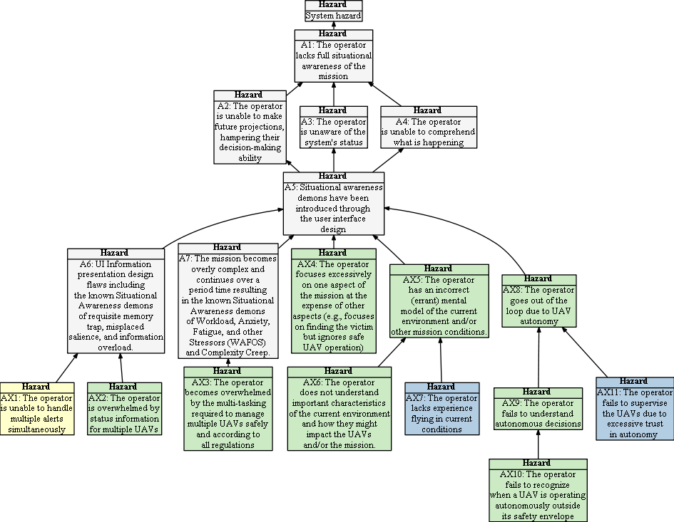

## Hazard Tree:  Mission awareness

 = Human Initiated Error,  = Loss of Situational awareness,  = Lack of Empowerment to Intervene

## AX1: The operator is unable to handle multiple alerts simultaneously</a>

| Hazard addressed | Context | Solution |
|:--|:--|:--|
|AX-1|Multiple sUAS in flight|Alerts must be prioritized according to severity|
|AX-2|Multiple sUAS in flight|When system-wide failures occur the operator can freeze the entire mission so that all sUAS are commanded to hover in place. This gives the RPIC time to plan recovery strategies and/or to manually issue RTL or LAND commands to individual sUAS.|

## AX2: The operator is overwhelmed by status information for multiple UAVs.</a>

| Hazard addressed | Context | Solution |
|:--|:--|:--|
|AX2-S1 |Active mission |UI must be designed to avoid information overload by careful prioritization of alerts|
|AX2-S2 |Active mission |Only critical status data shall be displayed continously, whilst other information shall be displayed upon request. (For example: display latitude and longitude upon demand and replace with velocity and a directional arrow). 

## AX3: The operator becomes overwhelmed by the multi-tasking required to manage multiple UAVs safely and according to all regulations</a>

| Hazard addressed | Context | Solution |
|:--|:--|:--|
|AX3-S1 |Multi-UAVs |Where feasible automate the behavior of UAVs so that they can execute autonomously.|

## AX4: The operator focuses excessively on one aspect of the mission at the expense of other aspects (e.g., focuses on finding the victim but ignores safe UAV operation)</a>

| Hazard addressed | Context | Solution |
|:--|:--|:--|
|AX4-S1|Multiple human engagers | One operator is designated as the sUAS safety officer with primary responsibility for overseeing safe use of the sUAS. |
|AX4-S2|Multiple human engagers | The UI provides a screen dedicated to sUAS command and control. |
|AX4-S3|Multiple sUAS| System runtime monitoring constantly checks for safety violations and raises alerts when such violations occur.|

## AX5: The operator has an incorrect (errant) mental model of the current environment.</a>

| Hazard addressed | Context | Solution |
|:--|:--|:--|
|AX5-S1 |Active mission|Provide visual clues about the current mission context (e.g., excessively cold temperature, high winds, poor lighting)|

## AX6: The operator does not understand important characteristics of the current environment and how they might impact the UAVs and/or the mission.</a>

| Hazard addressed | Context | Solution |
|:--|:--|:--|
|AX6-S1 |Active mission|When requested by the user, provide explanations of the potential impact of off-nominal conditions upon the mission (e.g., Extreme cold conditions could impact controllability of the UAV, or using RGB camera during dusk could result in low accuracy of onboard vision).|

## AX7: The operator lacks experience flying in current conditions </a>
| Hazard addressed | Context | Solution |
|:--|:--|:--|
See AX5, AX6

## AX8: The operator goes out of the loop due to UAV autonomy</a>

| Hazard addressed | Context | Solution |
|:--|:--|:--|
|AX8-S1|Active Mission|Provide active alerts when UAV makes a significant autonomous decision (e.g,. transitions from search to tracking mode).
|AX8-S2|Active Mission|When the operator is required to intervene, provide visual and audible alerts and a clear directive of their required intervention.|
|AX8-S3|Active Mission|When the operator needs to take manual control but is unsure of the direction in which the UAV is facing, they may request that the UAV autonomously turns to face them.|

## AX9: The operator fails to understand autonomous decisions</a>

| Hazard addressed | Context | Solution |
|:--|:--|:--|
|AX9-S1 |Multi-UAVs |Make explanations of UAVs' autonomous decisions available to the operator upon request or at the time the autonomous event occurs.|

## AX10: The operator fails to recognize when a UAV is operating autonomously outside its safety envelope</a>

| Hazard addressed | Context | Solution |
|:--|:--|:--|
|AX11 |Active Mission |Establish constraints on the safe operating space of the UAV, monitor for violations of those constraints, and clearly warn the operator when the UAV is operating outside its safety envelope.|

## AX11: The operator fails to supervise the UAVs due to excessive trust in autonomy  </a>

| Hazard addressed | Context | Solution |
|:--|:--|:--|
See AX8
