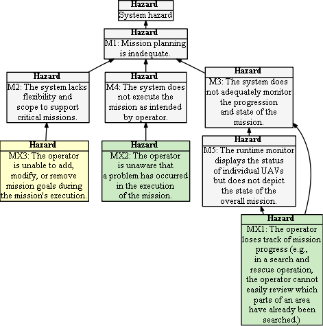

## Hazard Tree: Mission Planning and execution

Mission planning can be achieved in several different ways. To provide a scope for identifying relevant hazards and their mitigations we scope mission planning as follows:
   * Creating, storing, and retrieving flight routes defined as a set of waypoints (latitude, longitude, altitude).
   * Automatically generating flight routes for N drones to provide coverage over a region of the map specified by the user. 
   * Support for centralized and distributed goal setting and task allocations in which missions are focused on achieving specific goals with potentially multiple UAVs and multiple tasks
   * Synchronized flights (e.g, flying in formations)

 = Human Initiated Error,  =Loss of Situational Awareness,  = Lack of Empowerment to Intervene

##   MX1: The operator is unable to add, modify, or remove mission goals during the mission's execution.
| Hazard addressed | Context | Solution |
|:--|:--|:--|
|MX1-S1|Mission Execution|The system must empower the operator to manage the mission at runtime.|
|MX1-S2|Mission Execution|The operator can abort the entire mission at any time.|
|MX1-S2|Mission Execution|The operator can change the mission goals at any time.|

##   MX2: The operator is unaware that a problem has occurred in the execution of the mission.
| Hazard addressed | Context | Solution |
|:--|:--|:--|
|MX2-S1|Mission Execution|If the UAVs are unable to complete a planned mission task, they must report their failure and any known causes.|

##   MX3: The operator loses track of mission progress (e.g., in a search and rescue operation, the operator cannot easily review which parts of an area have already been searched.)
| Hazard addressed | Context | Solution |
|:--|:--|:--|
|MX-3-S1|Mission Execution|The system must track and display the progress of the mission as it unfolds.|
