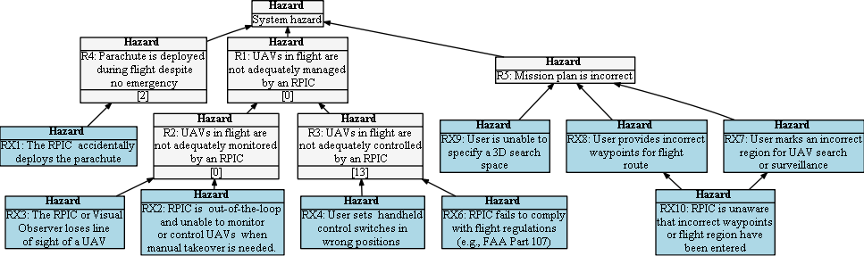

## Hazard Tree: Piloting the sUAS 

Intro goes here.

Quick Links: [RX1](#RX1) [RX2](#RX2) [RX3](#RX3) [RX4](#RX4) [RX5](#RX5) [(All hazards)](../README.md) 
:one:=Human initiated error, :two: =Loss of Situational awareness, :three: =Lack of empowerment to intervene, :four: =System Failure

 :construction: Image needs updating.

## <a name="RX1">RX1: The RPIC accidentally deploys the parachute</a> :one: 

| Hazard addressed | Context | Solution |
|:--|:--|:--|
|RX1-1|Context here|Requirement here|
|RX1-2|

## <a name="RX2">RX2: RPIC is out-of-the-loop and unable to monitor or control the sUAS when manual takeover is required</a> :two:

| Hazard addressed | Context | Solution |
|:--|:--|:--|
|RX2-1|
|RX2-2|

## <a name="RX3">RX3: The RPIC of Visual Observer loses line of sight for an sUAS</a> :two:

| Hazard addressed | Context |Solution |
|:--|:--|:--|
|RX3-1|
|RX3-2|
|RX3-3|

## <a name="RX4">RX4: User sets handheld control switches in incorrect positions</a> :one: :two:

| Hazard addressed | Context | Solution |
|:--|:--|:--|
|RX4-1|

## <a name="RX5">RX5: RPIC fails to comply with flight regulations (e.g., FAA Part 107)</a> :one:

| Hazard addressed | Context | Solution |
|:--|:--|:--|
|RX5-1|

## <a name="RX6">RX6: User provides incorrect waypoints or region for sUAS search or surveillance</a> :one: two:two:

| Hazard addressed | Context | Solution |
|:--|:--|:--|
|RX6-1|

## <a name="RX7">RX7: User has difficulty in marking the intended flight region or waypoints</a> :three:

| Hazard addressed | Context | Solution |
|:--|:--|:--|
|RX6-1|
