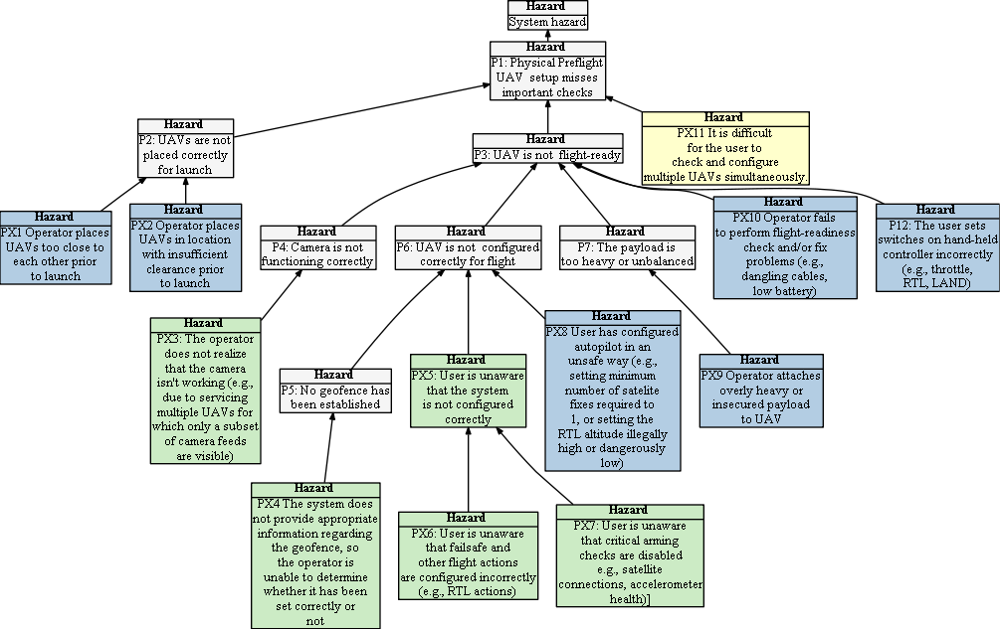

# Hazard Tree: Preflight Checks

**Description** 

Many accidents are caused by problems in preflight checks. For example, (1) turning off the GPS Fix arming check whilst running indoor maintenance tests, and forgetting to reset the check, or (2) setting the RTL altitude above the legal limit. Many prearming checks could be automated through the software, while others require consistent preflight checks, and could be supported by checklists and best practices.

 = Human Initiated Error,  = Loss of Situational awareness,  = Lack of Empowerment to Intervene

Return to [hazard list](../README.md) 

## Human-Drone Interaction Hazards 

###   <a name="PX1"/> PX1: Operator places UAVs too close to each other prior to launch 
When a system involves multiple coordinated UAVs then it is important to maintain minimum separation distance. This includes the launch phase of the mission.
| | Context | Solution |
|:--|:--|:--|
|PX1-S1|Multi-UAVs|RPIC receives proper training to conduct mandatory preflight checks |
|PX1-S2|Multi-UAVs|The system checks the coordinates of all UAVs on the ground and raises an alert if any of them are located less than minimum separation distance. |
|PX1-S3|Multi-UAVs|Where the system is not capable of managing collision avoidance during launch (e.g., through choreographed takeoff), then the operator should reposition the UAVs and/or carefully manage the launch and subsequent RTL. 
|PX1-S4|Multi-UAVs|If multiple UAVs are in RTL mode at the same time (even if in-air collisions are managed) then the system will check for minimum separation distance between their home coordinates and recommend remediations (e.g., staggering their return, modifying home coordinates).|

  

###  <a name="PX2"/> PX2: Operator places UAVs in location with insufficient clearance prior to launch 
|   | Context | Solution |
|:--|:--|:--|
|PX2-S1|Prelaunch|Operator is trained to check for obstruction|

  

###  <a name="PX3"/> PX3: The operator does not realize that a camera failure has occurred (e.g., due to servicing multiple UAVs for which only a subset of camera feeds are visible) 
|   | Context | Solution |
|:--|:--|:--|
|PX3-S1|Camera onboard|The operator should be able to view the camera feed from all UAVs with cameras onboard prior to launch.|
|PX3-S2|Camera onboard|The system should perform a diagnostic test to make sure that the camera cap has been removed prior to launch (e.g., using onboard vision to detect cap errors).|

  

###  <a name="PX4"/>  PX4: The system does not provide appropriate information regarding the geofence, so the operator is unable to determine whether it has been set correctly or not 
|   | Context | Solution |
|:--|:--|:--|
|PX4-S1||If the operator chooses to fly without a geofence in place, they must log their decision and rationale for foregoing the geofence.
|PX4-S2||When requested, the system shall visually display a UAV's geofence on the map.
|PX4-S3|Multi-UAVs|Where multiple UAVs are present, when requested by the user, the system shall visually display the outer boundary of the union of all UAVs' geofences. This increases awareness of the entire region in which UAVs are expected to fly.
|PX4-S4||When requested, the system shall display all geofence-related failsafe configurations and highlight exception cases (e.g., a UAV with unexpected or overlapping/conflicting configurations).|

  

 ###   <a name="PX5"/> PX5: User is unaware that the system is not configured correctly 
| Hazard addressed | Context | Solution |
|:--|:--|:--|
|PX5-S1|Preflight|The system shall raise an alert if a UAV is missing a geofence with legal altitude limits, an area greater than `minimum_area` and less than `maximum_area`, and whose boundaries are outside the current position of the UAV|
|PX5-S2|Multi-UAVs|When requested, the system shall display all geofence-related failsafe configurations and highlight exception cases (e.g., a UAV with unexpected configurations).|

  

###   <a name="PX6"/> PX6: User is unaware that failsafe and other flight actions are configured incorrectly (e.g., RTL actions) 
| Hazard addressed | Context | Solution |
|:--|:--|:--|
|PX6-S1|Preflight|The system shall store default failsafe configurations for *all* and *individual* UAVs. An alert shall be displayed if any UAV is configured differently from their default values. (Note: failsafe configurations can be set using multiple 3rd party packages, and should be checked prior to flight).|
|PX6-S2|Preflight|In case of conflicting failsafe configurations (e.g., same RTL altitude for one of multiple UAVs, the system shall alert the user and display  information of the invloved UAVs.|

  

###   <a name="PX7"/> PX7: User is unaware that critical arming  checks are disabled e.g., satellite connections, accelerometer health)
| Hazard addressed | Context | Solution |
|:--|:--|:--|
|PX7-S1|Preflight|The system shall store a list of default arming checks to be applied to all UAVs by type (e.g., PX4, Ardupilot). An alert shall be displayed if any UAV's internal configuration differs from the expected arming checks.  (Note: The list of arming checks, and their internal configurations can be set using multiple 3rd party packages, and should be automatically checked prior to flight by the system).

  

###   <a name="PX8"/> PX8: User has configured autopilot in an unsafe way (e.g., setting minimum number of satelite fixes required to 1, or setting the RTL altitude illegally high or dangerously low)
| Hazard addressed | Context | Solution |
|:--|:--|:--|
|PX8-S1|Preflight|The system shall store a list of default global configurations and boundary values to be applied to all UAVs by type (e.g., PX4, Ardupilot). An alert shall be displayed if any UAV's internal configuration differs from its expected global configurations. (Note: The list of arming checks, and their internal configurations can be set using multiple 3rd party packages, and should be automatically checked prior to flight by the system).

  

###   <a name="PX9"/> PX9: Operator attaches overly heavy or insecured payload to UAV
| Hazard addressed | Context | Solution |
|:--|:--|:--|
|PX9-S1|Payload|When payload is attached, the RPIC must inspect the UAV and its payload to ensure that it is valid and within acceptable payload limits as specified by the manufacturer|
|PX9-S2|Payload|Onboard analytics will monitor the UAV for behavior suggesting payload shifts or that the UAV is struggling to carry the payload.|

  

###   <a name="PX10"/> PX10: Operator fails to perform flight-readiness check and/or fix problems (e.g., dangling cables, low battery) 
| Hazard addressed | Context | Solution |
|:--|:--|:--|
|PX10-S1|Prelaunch|The system shall provide a check-list of preflight checks and the RPIC shall confirm the list for each UAV and for the mission as a whole|
|PX10-S2|Multi-UAV|When multiple UAVs are involved in the mission, the RPIC in charge of the flights shall verbally ascertain that all supporting RPICs and/or visual observers understand and acknowledge their roles in the mission.

  

###   <a name="PX11"/> PX11: It is difficult for the user to check and configure multiple UAVs simultaneously
| Hazard addressed | Context | Solution |
|:--|:--|:--|
|PX11-S1|Multi-UAVs|All preflight checks and warnings must support a multiple-UAV environment without the need for the RPIC to configure each UAV separately (unless desired)|

###   <a name="PX12"/> PX12: The user sets switches on hand-held controller incorrectly (e.g., throttle, RTL, LAND) and as a result the UAV responds to this predefined setting immediately during a human takeover event
| Hazard addressed | Context | Solution |
|:--|:--|:--|
|PX12-S1|Multi-UAVs, handheld controllers as backup|Preflight checklist must include checking the positions of all switches on the handheld device.|

