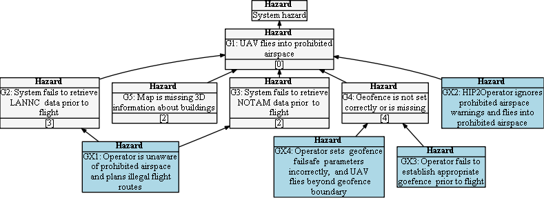

## Hazard Tree: Prohibited Airspace

**Description**

UAV flights must be in compliance with government and local ordinances and regulations. In the USA all commercial pilots must seek authorization for flights in controlled airspace.

** Hazard Tree **

