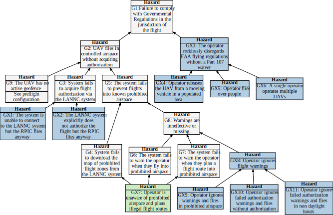

## Hazard Tree: Regulatory compliance

UAV flights must be in compliance with government and local ordinances and regulations. In the USA all commercial pilots must seek authorization for flights in controlled airspace. Activities such as logging or sharing data with the NASA infrastructure all serve to support compliance and safety, but exhibit clear tradeoffs against privacy. 

Quick Links: [GX1](#GX1) [GX2](#GX2) [GX3](#GX3) [GX7](#GX7) [GX8](#GX8)   [(All Hazards)](../README.md) 

 = Human initiated error,  =Loss of Situational awareness,  = Lack of empowerment to intervene

## <a name="GX1"> GX1: The system is unable to connect to the LANNC system but the RPIC flies anyway 
All RPICs flying in controlled airspace must receive flight authorization from the LANNC system via a third party (e.g., AirMap).  Flying in controlled airspace without authorization is reckless and illegal.  However, flight authorization may have been obtained in advance, acquired directly from ATC at a local airport, or requested immediately prior to the flight. 
| Hazard addressed | Solution |
|:--|:--|
|GX1-1|When the system is unable to connect to the LANNCs prior to a flight, a warning message must be prominently displayed on the screen.| 
|GX1-2|If authorization has been received prior to the flight or the RPIC is operating under a waiver, the warning is disabled when the RPIC specifies that they are flying under prior authorization. |
|GX1-3|If the RPIC attempts to arm and takeoff without authorization the RPIC is required to explicitly acknowledge the warning, and this acknowledgement is logged.|

## <a name="GX2"> GX2: Flight authorizations is denied by the LAANC system, but the RPIC flies anyway 
All RPICs flying in controlled airspace must receive flight authorization from the LANNC system via a third party (e.g., AirMap).  Flying in controlled airspace without authorization is reckless and illegal.  When flight authorization is denied, the RPIC may modify the request and resubmit. 
| Hazard addressed | Solution |
|:--|:--|
|GX2-1|When flight authorization is denied a warning message must be prominently displayed on the screen.| 
|GX2-2|If the RPIC attempts to arm and takeoff without authorization the RPIC is required to explicitly acknowledge the warning, and this acknowledgement is logged.|

## <a name="GX3">GX3: (G4-G6) The operator recklessly disregards FAA flying regulations without a Part 107 waiver" 
All of these hazards relate to reckless behavior as defined by Part 107 regulations. 
| Hazard addressed | Solution |
|:--|:--|
|GX3-1|Provide a reminder with required acknowledgement to fly responsibly in compliance with FAA regulations on the start up screen.|
|GX3-2|Provide a link to a page listing FAA regulations as part of each application. |
|GX3-3|Store Part 107 certification numbers in the system for frequent commercial RPICs. |
|GX3-4|Create a flight file that logs meta-data for each flight including time of day, any infringements upon authorized airspace, and the RPIC of record. |

## <a name="GX7"> GX7: Operator is unaware of prohibited airspace and plans and/or executes illegal flight routes 
| Hazard addressed | Solution |
|:--|:--|
|GX7-1|Data describing all prohibited airspace in the vicinity must be retrieved and displayed visually on the map |
|GX7-2|Warnings must be issued if any planned flight would create an incursion into prohibited airspace |
|GX7-3|Situational awareness demons related to information overload and misplaced salience must be addressed through principled design and user evaluations |

## <a name="GX8"> GX8: Operator ignores warnings about prohibited airspace 
| Hazard addressed | Solution |
|:--|:--|
|GX8-1|Incursions into prohibited airspace must be logged|

