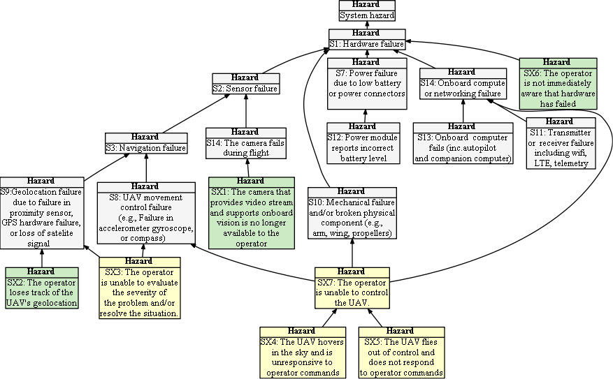

## Hazard Tree: Hardware and Sensors

Human technicians are responsible for setting up hardware (e.g., sensors, UAV), while the RPIC is responsible 
for preflight inspections and for handling runtime faults as they occur. 

:construction: Fix figure and ordering.

Quick Links: [GX1](#GX1) [GX2](#GX2) [GX3](#GX3) [GX7](#GX7) [GX8](#GX8)   [(All Hazards)](../README.md) 

 = Human initiated error,  =Loss of Situational awareness,  = Lack of empowerment to intervene

## SX1: The camera that provides video stream and supports onboard vision becomes unavailable to the operator when they need it to support the mission
| Hazard addressed | Context | Solution |
|:--|:--|:--|
|SX1-S1|Inflight|The system supports a remote camera reset function|
|SX1-S2|Multi-UAV,Inflight|The system allows the operator to request a replacement UAV by recalling the UAV with the non-functioning camera and replacing it with another UAV (airborne or on the ground) with a functioning camera)|

## SX2: The operator loses track of the UAV's geolocation 
| Hazard addressed | Context | Solution |
|:--|:--|:--|
|SX2-S1|Inflight|When the UAV's geolocation becomes uncertain due to loss of satellite or other detectable errors, current uncertainty of the UAV's position shall be depicted on the UI (e.g., through an ever enlarging circle representing the predicted location of the UAV).|

## SX3: The operator is unable to evaluate the severity of the geolocation problem and/or resolve the situation. 
| Hazard addressed | Context | Solution |
|:--|:--|:--|
|SX3-S1|Inflight|On onboard companion computer provides camera diagnostic capabilities and reports any detected errors and their severity to the operator|

## SX4: The UAV hovers in the sky and is unresponsive to operator commands 
| Hazard addressed | Context | Solution |
|:--|:--|:--|
|SX4-S1|In-Air|The position and expected behavior of the UAV shall be monitored continuously. If a UAV does not behave accoring to its last command (e.g., not moving when ordered to fly to a waypoint), the system shall display a warning message and suggest to re-send the previous command.|
|SX4-S2|In-Air|In case of an unresponsive UAV the RPIC shall switch to the backup control (e.g. hand-held) and issue either an RTL command or a land in place command if the UAV can be landed safely at its corrent location. |

## SX5: The UAV flies out of control and does not respond to operator commands 
| Hazard addressed | Context | Solution |
|:--|:--|:--|
|SX5-S1|In-Air|If the operator experiences loss-of-control they can trigger an emergency alert|
|SX5-S2|In-Air,Active onboard analytics|Where onboard analytics are active and a deviation between commands and response are detected, the system issues a loss-of-control warning|
|SX5-S3|In-Air, Multi-UAVs|Where multiple UAVs are flying in the locality of the uncontrolled UAV, a zone-avoidance warning is immediately broadcast around the uncontrolled zone|

## SX6: The operator is not immediately aware that hardware has failed 
| Hazard addressed | Context | Solution |
|:--|:--|:--|
|SX6-S1|All|The runtime monitor shall continually check the health of critical hardware components and raise alerts when they fail.|

