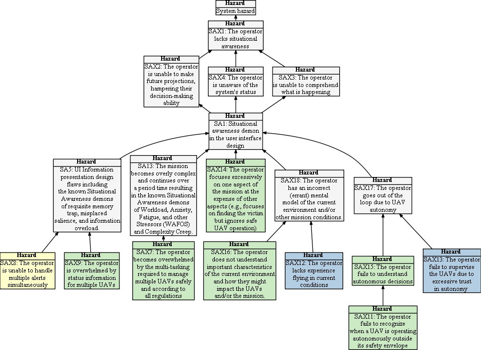

## Hazard Tree: Mission awareness

Something about situational awareness demons.

[(#)

Quick Links: [AX1](#AX1) [AX2](#AX2) [AX3](#AX3) [AX4](#AX4) [AX5](#AX5) [(All hazards)](../README.md) 
:one:=Human initiated error, :two: =Loss of Situational awareness, :three: =Lack of empowerment to intervene, :four: =System Failure

:construction: update figure

## <a name="AX1">AX1: Operator is unable to handle multiple alerts simultaneously.</a> :one: :one:

| Hazard addressed | Context | Solution |
|:--|:--|:--|
|AX1-1|Multiple sUAS in flight|Alerts must be prioritized according to severity|
|AX1-2|Multiple sUAS in flight|When system-wide failures occur the operator can freeze the entire mission so that all sUAS are commanded to hover in place. This gives the RPIC time to plan recovery strategies and/or to manually issue RTL or LAND commands to individual sUAS.|

## <a name="AX2">AX2: Operator focuses on the life-saving mission at the expense of managing sUAS safety</a> :one:

| Hazard addressed | Context | Solution |
|:--|:--|:--|
|AX2-1|Multiple human engagers | One operator is designated as the sUAS safety officer with primary responsibility for overseeing safe use of the sUAS. |
|AX2-2|Multiple human engagers | The UI provides a screen dedicated to sUAS command and control. |
|AX2-3|Multiple sUAS| System runtime monitoring constantly checks for safety violations and raises alerts when such violations occur.|

## <a name="AX3">AX3: Operator focuses on the mission and fails to manage UAV safety.</a> :one:

| Hazard addressed | Context |Solution |
|:--|:--|:--|
|AX3-1|
|AX3-2|
|AX3-3|

## <a name="AX4">AX4: Operator focuses on one UAV and misses vital information about other UAVs.</a> :one: :two:

| Hazard addressed | Context | Solution |
|:--|:--|:--|
|AX4-1|

## <a name="AX5">AX5: Operator fails to supervise sUAS flights due to excessive trust in autonomy.</a> :one:

| Hazard addressed | Context | Solution |
|:--|:--|:--|
|AX5-1|

## <a name="AX6">AX6: Operator lacks experience flying in current conditions..</a> :one:

| Hazard addressed | Context | Solution |
|:--|:--|:--|
|AX6-1|

## <a name="AX5">AX7: Operator fails to recognize that the UAV is operating autonomously outside its safety envelope</a> :one:

| Hazard addressed | Context | Solution |
|:--|:--|:--|
|AX7-1|

