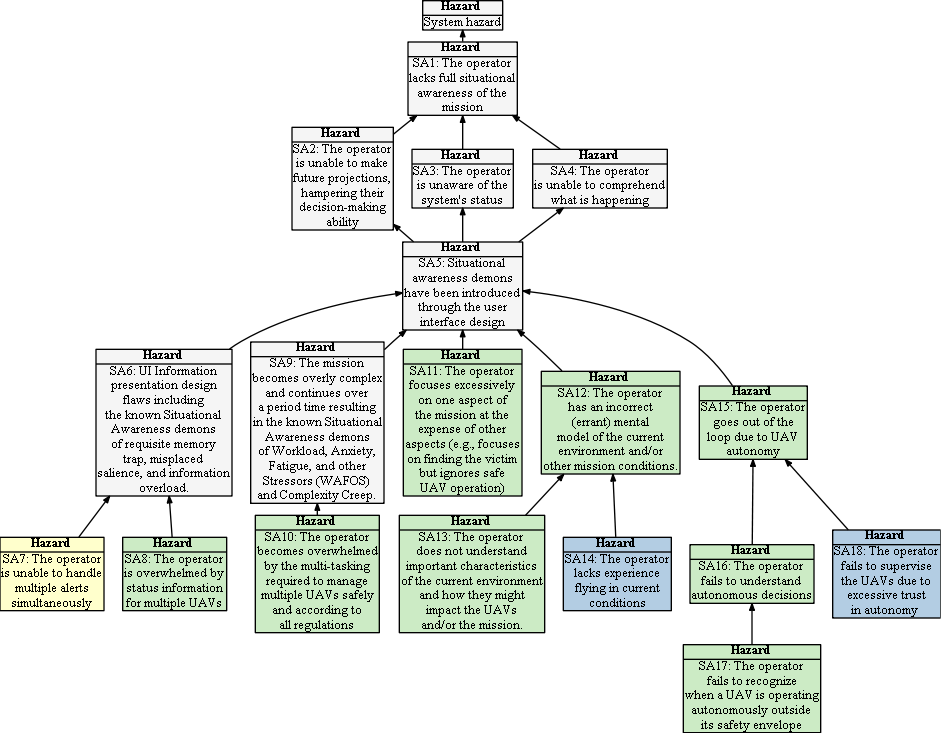

## Hazard Tree:  Mission awareness

Something about situational awareness demons.

[(#)

 = Human Initiated Error,  = Loss of Situational awareness,  = Lack of Empowerment to Intervene

## <a name="SA8">SA8: The operator is unable to handle multiple alerts simultaneously</a>

| Hazard addressed | Context | Solution |
|:--|:--|:--|
|SAX8-1|Multiple sUAS in flight|Alerts must be prioritized according to severity|
|SAX8-2|Multiple sUAS in flight|When system-wide failures occur the operator can freeze the entire mission so that all sUAS are commanded to hover in place. This gives the RPIC time to plan recovery strategies and/or to manually issue RTL or LAND commands to individual sUAS.|

## <a name="SA10">SA10: The operator becomes overwhelmed by the multi-tasking required to manage multiple UAVs safely and according to all regulations</a>

| Hazard addressed | Context | Solution |
|:--|:--|:--|
|SAX |Context |Solution|

## <a name="SA11">SA11: The operator focuses excessively on one aspect of the mission at the expense of other aspects (e.g., focuses on finding the victim but ignores safe UAV operation)</a>

| Hazard addressed | Context | Solution |
|:--|:--|:--|
|SAX14-1|Multiple human engagers | One operator is designated as the sUAS safety officer with primary responsibility for overseeing safe use of the sUAS. |
|SAX14-2|Multiple human engagers | The UI provides a screen dedicated to sUAS command and control. |
|SAX14-3|Multiple sUAS| System runtime monitoring constantly checks for safety violations and raises alerts when such violations occur.|

## <a name="SA12">SA12: The operator has an incorrect (errant) mental model of the current environment.</a>

| Hazard addressed | Context | Solution |
|:--|:--|:--|
|SAX |Context |Solution|

## <a name="SA13">SA13: The operator does not understand important characteristics of the current environment and how they might impact the UAVs and/or the mission.</a>

| Hazard addressed | Context | Solution |
|:--|:--|:--|
|SAX |Context |Solution|

## <a name="SA14">SA14: The operator lacks experience flying in current conditions </a>

| Hazard addressed | Context | Solution |
|:--|:--|:--|
|SAX |Context |Solution|

## <a name="SA15">SAX15: The operator goes out of the loop due to UAV autonomy</a>

| Hazard addressed | Context | Solution |
|:--|:--|:--|
|SAX |Context |Solution|

## <a name="SA16">SAX16: The operator fails to understand autonomous decisions</a>

| Hazard addressed | Context | Solution |
|:--|:--|:--|
|SAX |Context |Solution|

## <a name="SA17">SA17: The operator fails to recognize when a UAV is operating autonomously outside its safety envelope</a>

| Hazard addressed | Context | Solution |
|:--|:--|:--|
|SAX |Context |Solution|

## <a name="SA18">SA18: The operator fails to supervise the UAVs due to excessive trust in autonomy  </a>

| Hazard addressed | Context | Solution |
|:--|:--|:--|
|SAX |Context |Solution|
