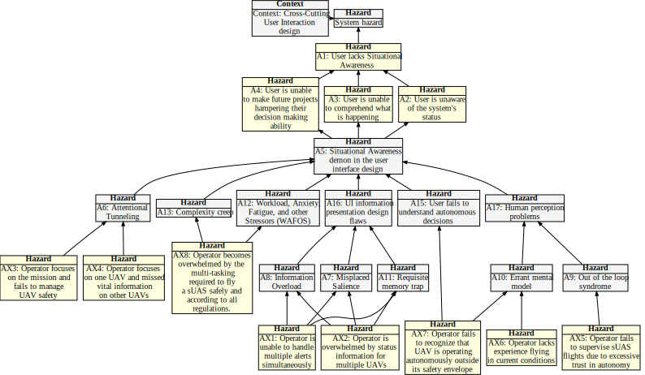

## Hazard Tree: Preflight Checks

Intro goes here.

Quick Links: [AX1](#AX1) [AX2](#AX2) [AX3](#AX3) [AX4](#AX4) [AX5](#AX5) [(All hazards)](../README.md) 
:one:=Human initiated error, :two: =Loss of Situational awareness, :three: =Lack of empowerment to intervene, :four: =System Failure

 :construction: Fix diagram (too wide).  Move AX14 to flight management.  Create a new hazard tree on Autonomy (from end of paper)

## <a name="AX1">AX1: UI introduces attentional tunneling</a> :one: :one:

| Hazard addressed | Context | Solution |
|:--|:--|:--|
|AX1-1|Context here|Requirement here|
|AX1-2|

## <a name="AX2">AX2: UI causes misplaced salience</a> :one:

| Hazard addressed | Context | Solution |
|:--|:--|:--|
|AX2-1|
|AX2-2|

## <a name="AX3">AX3: UI introduces information overload</a> :one:

| Hazard addressed | Context |Solution |
|:--|:--|:--|
|AX3-1|
|AX3-2|
|AX3-3|

## <a name="AX4">AX4: The user suffers from out of the loop syndrome</a> :one: :two:

| Hazard addressed | Context | Solution |
|:--|:--|:--|
|AX4-1|

## <a name="AX5">AX5: User developers an errant mental model</a> :one:

| Hazard addressed | Context | Solution |
|:--|:--|:--|
|AX5-1|

## <a name="AX5">AX6: User is unable to keep all pertinent information in their short-term memory, as the UI suffers from requisite memory trap.</a> :one:

| Hazard addressed | Context | Solution |
|:--|:--|:--|
|AX5-1|

## <a name="AX5">AX7: The operating environment introduces the demon of Workload, Anxiety, Fatigue, and other Stressors (WAFOS)</a> :one:

| Hazard addressed | Context | Solution |
|:--|:--|:--|
|AX5-1|

