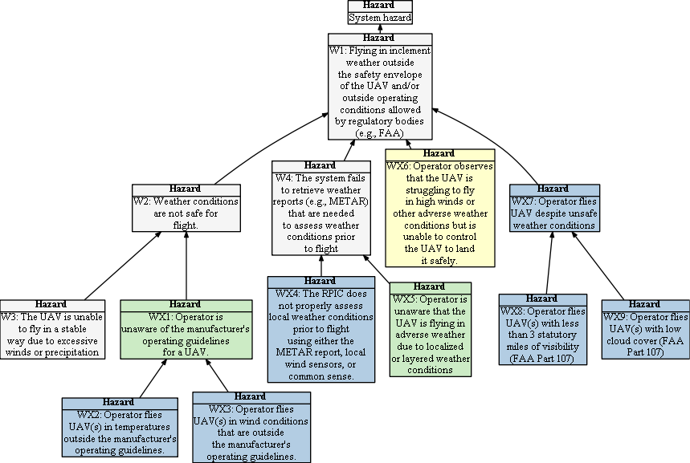

# Hazard Tree: Weather 

**Description**

UAV can only be flown in certain weather conditions with sufficient visibility and cloud cover above a minimum altitude.

 = Human Initiated Error,  =Loss of Situational Awareness,  = Lack of Empowerment to Intervene   

Return to [hazard list](../README.md) 

## Human-Drone Interaction Hazards

###  <a name="WX1"/> WX1: Operator is unaware of the manufacturer's operating guidelines for a UAV 
| | Context | Solution |
|:--|:--|:--|
|WX1-S1|Prelaunch|When requested by the RPIC, the system shall display operating guidelines including upper and lower temperatures and maximum wind velocity in which the UAV can fly|
|WX1-S2|Prelaunch|Prior to flight, the system shall compare the operating guidelines of each UAV against the retrieved METAR report, make a determination of its ability to fly in the current and projected conditions, and inform the user if the flight should be cancelled or postponed due to weather conditions. |
|WX-S3|Prelaunch| Warnings shall be issued if weather conditions will require any UAV to operator outside their safe operating guidelines. |
|WX-S4|Prelaunch| If the RPIC decides to fly despite the weather-related warning, they must log an override in the system with a justification. |

  

###  <a name="WX2"/> WX2: Operator flies UAV(s) in temperatures outside the manufacturer's operating guidelines 
See WX1

  

###   <a name="WX3"/> WX3: Operator flies UAV(s) in wind conditions that are outside the manufacturer's operating guidelines 
See WX1

  

###  <a name="WX4"/> WX4: The RPIC does not properly assess local weather conditions prior to flight using either the METAR report, local wind sensors, or common sense 
|  | Context | Solution |
|:--|:--|:--|
|WX4-S1|Prelaunch|When adverse weather conditions are detected through the METAR or other available services or sensors, an adverse weather indicator shall be displayed on the screen even if all UAVs are capable of flying in those conditions.|
|WX4-S2|Prelaunch|When requested by the user, a full weather condition report will be displayed.|

  

###  <a name="WX5"/> WX5: Operator is unaware that the UAV is flying in adverse weather due to localized or layered weather conditions 
|  | Context | Solution |
|:--|:--|:--|
|WX5-S1|In-flight|Onboard analytics shall detect adverse wind conditions through analyzing stability and motor strain of the UAV|
|WX5-S2|In-flight|The system shall raise an alert when adverse weather conditions are detected through onboard analytics|

  

###  <a name="WX6"/> WX6: Operator observes that the UAV is struggling to fly in high winds or other adverse weather conditions but is unable to control the UAV to land it safely 
|  | Context | Solution |
|:--|:--|:--|
|WX6-S1|In-flight, Adverse Weather|The system shall recommend remediations to the operator according to the severity of the weather (e.g., LAND, RTL, Change altitude), and shall act upon the operator's decision. |

  

###  <a name="WX7"/> WX7: Operator flies UAV despite unsafe weather conditions 
|  | Context | Solution |
|:--|:--|:--|
|WX7-1|Prelaunch| The METAR weather report (or equivalent in non USA jurisdictions) shall be retrieved and analyzed. Warnings shall be issued if weather conditions preclude legal flights |
|WX7-2|Prelaunch| If the RPIC decides to fly despite the weather-related warning, they must log an override in the system with a justification. |

  

###    <a name="WX8"/> WX8: Operator flies UAV(s) with less than 3 statutory miles of visibility (FAA Part 107)
See WX7

  

###  <a name="WX9"/> WX9: Operator flies UAV(s) with low cloud cover (FAA Part 107) 
See WX7

